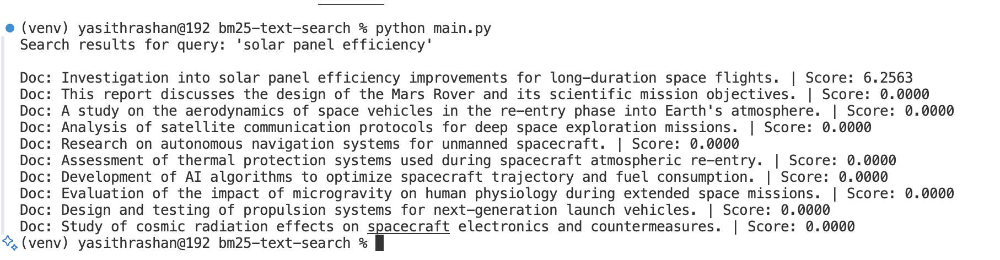
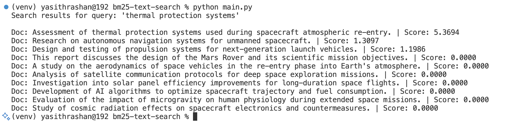

# BM25 Information Retrieval System

A Python implementation of the BM25 (Best Matching 25) ranking algorithm for document search and information retrieval.

## Overview

BM25 is a probabilistic ranking function used by search engines to estimate the relevance of documents to a given search query. This implementation provides a simple yet effective way to perform text-based document retrieval.

## Features

- **Fast document scoring**: Efficient BM25 scoring algorithm
- **Customizable parameters**: Adjustable k1 and b parameters for fine-tuning
- **Simple API**: Easy-to-use search interface
- **Ranked results**: Returns documents sorted by relevance score

## Installation

No external dependencies required - uses only Python standard library.

```python
# Simply include the BM25 class in your project
from bm25 import BM25
```

## Usage

### Basic Example

```python
from bm25 import BM25

# Sample document corpus
documents = [
    "This report discusses the design of the Mars Rover and its scientific mission objectives.",
    "A study on the aerodynamics of space vehicles in the re-entry phase into Earth's atmosphere.",
    "Analysis of satellite communication protocols for deep space exploration missions.",
    "Investigation into solar panel efficiency improvements for long-duration space flights.",
    "Research on autonomous navigation systems for unmanned spacecraft.",
    "Assessment of thermal protection systems used during spacecraft atmospheric re-entry.",
    "Development of AI algorithms to optimize spacecraft trajectory and fuel consumption.",
    "Evaluation of the impact of microgravity on human physiology during extended space missions.",
    "Design and testing of propulsion systems for next-generation launch vehicles.",
    "Study of cosmic radiation effects on spacecraft electronics and countermeasures.",
]

# Initialize BM25 with documents
bm25 = BM25(documents)

# Search for relevant documents
query = "solar panel efficiency"
results = bm25.search(query)

# Display results
print(f"Search results for query: '{query}'\n")
for idx, score in results:
    print(f"Doc: {documents[idx]} | Score: {score:.4f}")
```

### Example Output Screenshots

The following screenshots demonstrate the BM25 algorithm in action with different queries:

#### Query: "solar panel efficiency"


This query demonstrates precise matching - only the document containing "solar panel efficiency" receives a high relevance score (6.2563), while all other documents score 0.0000.

#### Query: "thermal protection systems"


This query shows partial matching behavior - the primary document about "thermal protection systems" scores highest (5.3694), but documents containing related terms like "systems" also receive modest scores.

## Advanced Usage

```python
# Custom parameters for different use cases
bm25 = BM25(documents, k1=2.0, b=0.5)

# Multiple queries
queries = ["Mars Rover", "space communication", "thermal protection"]
for query in queries:
    results = bm25.search(query)
    print(f"Top result for '{query}': {documents[results[0][0]]}")
```

## Parameters

### Constructor Parameters

- **corpus** (list): List of documents as strings
- **k1** (float, default=1.5): Controls term frequency scaling
  - Higher values increase the impact of term frequency
  - Typical range: 1.2 - 2.0
- **b** (float, default=0.75): Controls document length normalization
  - 0 = no normalization, 1 = full normalization
  - Typical range: 0.5 - 0.8

## API Reference

### Class: BM25

#### `__init__(self, corpus, k1=1.5, b=0.75)`
Initialize the BM25 system with a document corpus.

#### `search(self, query)`
Search for documents matching the query.

**Parameters:**
- `query` (str): Search query string

**Returns:**
- List of tuples: `[(document_index, score), ...]` sorted by relevance (highest first)

#### `score(self, query, index)`
Calculate BM25 score for a specific document.

**Parameters:**
- `query` (str): Search query string
- `index` (int): Document index in corpus

**Returns:**
- `float`: BM25 relevance score

## Algorithm Details

The BM25 formula used:

```
Score(D,Q) = Σ IDF(qi) * (f(qi,D) * (k1 + 1)) / (f(qi,D) + k1 * (1 - b + b * |D| / avgdl))
```

Where:
- `D` = document
- `Q` = query
- `qi` = query terms
- `f(qi,D)` = term frequency in document
- `|D|` = document length
- `avgdl` = average document length in corpus
- `IDF` = Inverse Document Frequency

## Performance Considerations

- **Time Complexity**: O(n) for search, where n is the number of documents
- **Space Complexity**: O(v) where v is vocabulary size
- **Preprocessing**: Document frequency and IDF calculations done during initialization

## Use Cases

- **Document Search**: Find relevant documents in a corpus
- **Information Retrieval**: Academic paper search, legal document retrieval
- **Content Recommendation**: Similar document suggestions
- **Search Engines**: Basic ranking for small to medium document collections

## Limitations

- **No phrase matching**: Treats queries as bag of words
- **No semantic understanding**: Purely term-based matching
- **Memory usage**: Stores entire corpus in memory
- **Single language**: Works best with English text

## Contributing

Feel free to contribute improvements:
- Add preprocessing options (stemming, stop words)
- Implement phrase queries
- Add support for document metadata
- Performance optimizations

## License

This implementation is provided as-is for educational and research purposes.

## References

- Robertson, Stephen E., and Hugo Zaragoza. "The probabilistic relevance framework: BM25 and beyond." Foundations and Trends in Information Retrieval 3.4 (2009): 333-389.
- Elasticsearch BM25 Implementation
- Lucene Scoring Documentation